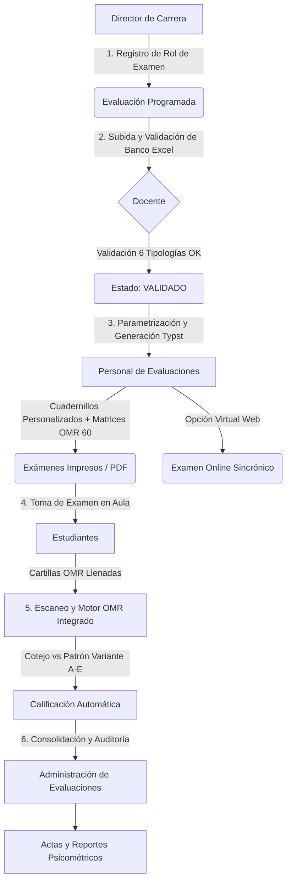

# Plan de Implementación Integral: Sistema de Evaluaciones SEA / SISA (XpertiFlow)

Documento maestro de alcance y hoja de ruta secuencial para la completitud y puesta en producción del flujo operativo de evaluaciones institucionales UNITEPC, utilizando la materia piloto **[CPEC18] Auditoría Tributaria (Complementaria Contaduría Pública)**.

---

## 1. Visión General del Flujo y Roles

---

## 2. Fases de Implementación Punto a Punto

### FASE 1: Registro del Rol de Examen (Rol: Director de Carrera)
- **Objetivo**: Completar y asegurar la robustez de la programación académica.
- **Acciones Clave**:
  - Selección de Gestión (ej. 2-2026), Sede (Cochabamba), Carrera (*Complementaria Contaduría Pública*), Materia (*[CPEC18] Auditoría Tributaria*), Grupo (*TA-01*).
  - Definición de Tipo de Examen: 1er Parcial, 2do Parcial, Examen Final, 2do Turno.
  - Selección de Modalidad de Evaluación:
    1. **Presencial con Cartilla OMR** (Predeterminada, 60 filas OMR, Typst).
    2. **Presencial sin Cartilla** (Respuestas en el mismo cuadernillo de examen).
    3. **Virtual Online** (Resolución sincrónica en portal estudiantil).
  - Habilitación de ventana de fechas para entrega de banco de preguntas por el docente.
  - Almacenamiento persistente y emisión de evento en bitácora de auditoría.

---

### FASE 2: Subida y Validación del Banco de Preguntas (Rol: Docente)
- **Objetivo**: Garantizar que el banco cargado cumpla con la estructura pedagógica de las 6 tipologías oficiales UNITEPC y cuente con validación de seguridad de doble factor.
- **Acciones Clave**:
  - Carga masiva de archivo `.xlsx` (30 o 60 preguntas).
  - Validador sintáctico y de consistencia pedagógica:
    - *Sección 1*: Selección Múltiple (5 opciones A-E, 1 sola correcta).
    - *Sección 2*: Verdadero / Falso Simple (Opciones A y B).
    - *Sección 3*: Verdadero / Falso Complejas (Premisas combinadas 1-4 con claves A-E).
    - *Sección 4*: Relación de Premisas (A: solo 1ra, B: solo 2da, C: ambas, D: ninguna).
    - *Sección 5*: Caso Clínico / Problema (Caso estructurado con preguntas dependientes).
    - *Sección 6*: Emparejamiento Ampliado (Enunciados contra lista maestra de opciones A-E).
  - Feedback visual interactivo: Resumen de reactivos válidos, advertencias y detección de errores por fila/columna.
  - **Doble Autenticación Docente (2FA / MFA)**:
    - Mecanismo de seguridad en dos pasos (Código de Verificación / OTP / Token de Seguridad) requerido para que el docente autorice la entrega formal y el sellado criptográfico del banco.
  - Transición formal de estado del examen a **`VALIDADO`** (congelamiento de reactivos y firma digital para evitar adulteraciones posteriores).

---

### FASE 3: Parametrización y Generación Typst (Rol: Personal de Evaluaciones)
- **Objetivo**: Renderizado de alta velocidad de cuadernillos, matrices de corrección y planillas de firmas.
- **Acciones Clave**:
  - Parametrización:
    - Generación de 2 a 5 Variantes (Tipo A, B, C, D, E).
    - Aleatorización determinista mediante semilla por estudiante.
    - Sincronización en tiempo real con lista de estudiantes (API Gateway `byGroup?groupId={{groupId}}`).
  - Compilación Typst de Exámenes (Blanco y Negro Puro):
    - Tipografía estandarizada: **Times New Roman 11pt**.
    - Hoja oficio (*US Legal*), margen general de `2 cm` a todos los lados.
    - **Cero Fondos Grises/Colores (`fill: none`)**: Optimizado para fotocopiado e impresión masiva a blanco y negro.
    - **Código de Estudiante al Doble de Tamaño (`18pt Bold`)**: Identificación visual inmediata en mesa y lectura rápida.
    - **Espacio Ampliado de Firma de Estudiante**: Renglón punteado de firma extendido ocupando todo el ancho de la cabecera.
    - Cartilla OMR horizontal con el doble de espaciado vertical entre números (1 a 60 reactivos con 5 opciones A-E).
    - Pie de página dinámico con nombre completo y código del alumno en hojas impares (Páginas 1 y 3).
  - **Generación de Planilla Oficial de Asistencia y Firmas de Estudiantes (PDF)**:
    - Documento complementario indispensable que se entrega físicamente junto con el paquete de exámenes al docente/veedor.
    - Cabecera institucional completa idéntica a la del examen (Logo UNITEPC, Gestión, Carrera, Materia, Docente, Grupo, Fecha, Aula).
    - Tabla ordenada con: `N°`, `Código`, `Apellidos y Nombres`, `Variante Asignada (Tipo A/B)`, y `Espacio de Firma de Puño y Letra`.
    - Cuadro resumen de asistencia: Total Matriculados, Presentes, Ausentes y firma de conformidad del docente titular.
  - Generación de Patrones Oficiales de Corrección:
    - PDF oficial de matriz 1 a 60 reactivos con resaltado de claves activas y reactivos de reserva.
    - Exportación a planilla Remark Excel (`P1` a `P60`) como respaldo para el motor OMR.

---

### FASE 4: Motor de Calificación OMR Integrado (Rol: Personal de Evaluaciones)
- **Objetivo**: Realizar la lectura y corrección óptica directamente dentro del sistema, sin depender de software de terceros.
- **Acciones Clave**:
  - Módulo de procesamiento de imágenes / escaneos de cartillas OMR (JPG, PNG, PDF escaneado).
  - Algoritmo de visión computacional y lectura óptica:
    - Detección de marcadores de esquina / alineación.
    - Segmentación de las 60 filas × 5 columnas de burbujas (A, B, C, D, E).
    - Detección de umbral de densidad de tinta / relleno (detección de omisiones, marcas múltiples y marcas dudosas).
    - Lectura del ID / Código de estudiante y Variante de examen.
  - Cotejo automático:
    - Comparación de cada reactivo marcado contra la matriz de la variante específica del estudiante.
    - Asignación de puntajes configurables (correctas, incorrectas, en blanco).
  - Interfaz de revisión y verificación:
    - Visor interactivo con cartilla digitalizada al lado del resultado para validación humana rápida de casos con borrones.

---

### FASE 5: Modalidad de Examen Virtual Web
- **Objetivo**: Habilitar la resolución de exámenes en línea manteniendo la misma equidad y variantes.
- **Acciones Clave**:
  - Interfaz responsiva para el estudiante (Angular + PrimeNG):
    - Renderizado de reactivos según la variante asignada al estudiante (con fórmulas, casos y emparejamientos).
    - Temporizador sincrónico con aviso de tiempo restante.
    - Guardado automático de respuestas en tiempo real (anti-desconexión).
    - Bloqueo y envío automático al expirar el tiempo.
  - Calificación instantánea al finalizar el intento y almacenamiento en base de datos.

---

### FASE 6: Proceso Administrativo, Reportes y Bitácora
- **Objetivo**: Control, análisis psicométrico y cierre de actas.
- **Acciones Clave**:
  - **Administración de Evaluaciones**: Monitoreo de estado por materia, docente, sede y grupo.
  - **Reportes Psicométricos y Estadísticos**:
    - Índice de dificultad por pregunta.
    - Índice de discriminación por reactivo.
    - Curva de distribución de notas del grupo.
  - **Bitácora de Auditoría Inmutable**: Registro de cada evento con usuario, rol, IP, timestamp y detalle de acción.

---

## 3. Plan de Verificación y Criterios de Aceptación

1. **Prueba End-to-End con Materia Piloto [CPEC18]**:
   - Registro de rol para *Auditoría Tributaria*.
   - Carga del banco válido de 30/60 preguntas.
   - Generación de cuadernillos Typst individuales para estudiantes oficiales.
   - Procesamiento de cartillas marcadas en el motor OMR y verificación de notas obtenidas.
   - Simulación de examen en modalidad virtual.
2. **Inspección Visual y Estética**:
   - Cero anomalías tipográficas (Times New Roman 11pt estricto).
   - Cartilla OMR 100% visible y alineada.
3. **Consolidación en Repositorio GitHub**:
   - Repositorio `evaluaciones` sincronizado con todos los módulos y documentación.

