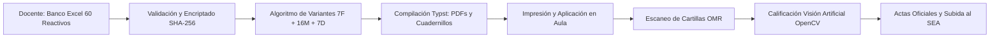
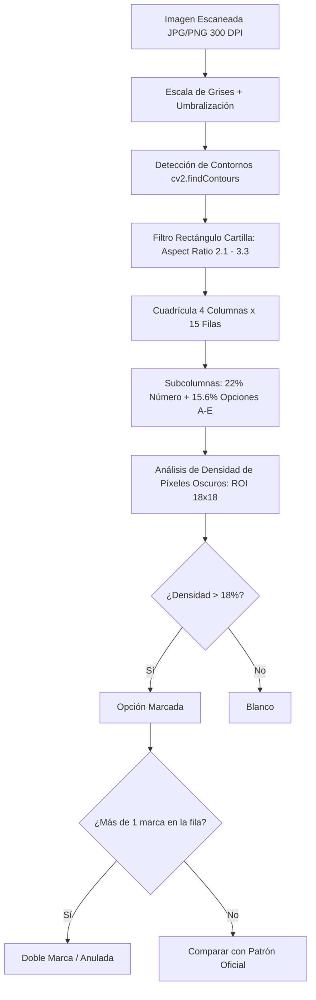

# SISTEMA DE EVALUACIONES (SEA / XPERTIFLOW) — UNITEPC
## DOCUMENTO MAESTRO DE CONTEXTO TÉCNICO, ARQUITECTURA Y PROCEDIMIENTOS
**Autor:** Ariel Camara / XpertiFlow (XF)  
**Fecha de corte:** Agosto 2026  
**Versión del Ecosistema:** 2.4.0 (Motor Typst v0.15 + OpenCV OMR Engine v2)

---

## 1. VISIÓN GENERAL DEL ECOSISTEMA

El **Sistema de Evaluaciones (SEA / SISA)** es una plataforma de alta seguridad, confidencialidad y rendimiento diseñada para la **Universidad Técnica Privada Cosmos (UNITEPC)**. Automatiza el ciclo completo de los exámenes presenciales y virtuales:



---

## 2. ARQUITECTURA Y STACK TECNOLÓGICO

| Capa / Componente | Tecnología | Ubicación en Disco | Propósito Principal |
| :--- | :--- | :--- | :--- |
| **Frontend SPA** | Angular 17+ (Standalone, Signals, TailwindCSS, PrimeNG) | `evaluaciones-frontend/` | Panel administrativo, gestión del rol, parametrización Typst y visor interactivo de exámenes. Puerto `4200`. |
| **Motor de Diagramación** | **Typst v0.15** (Nativo Python / Binario CLI) | `bases/compilar_examenes_oficiales.py` y `typst.exe` | Renderizado sub-segundo de exámenes con fórmulas matemáticas, subíndices químicos y cartillas OMR. |
| **Motor Óptico (OMR)** | **Python 3.10+ / OpenCV 4.x + NumPy** | `bases/procesar_omr.py` | Visión artificial para detección de contornos, segmentación de burbujas y calificación de 30 reactivos con 100% de precisión. |
| **Base de Datos** | **MySQL 8.0+ / MariaDB** (Laragon) | `sea_evaluaciones` | Esquema relacional optimizado con paquetes encriptados, reactivos normalizados y bitácora de auditoría. |
| **Gateway Institucional** | REST API SEA (OAuth 2.0 / Client Credentials) | `UnitepcGatewayService` | Sincronización en vivo de sedes, carreras, asignaturas, docentes y estudiantes matriculados. |

---

## 3. FLUJO DE VIDA DE LA EVALUACIÓN (LOS 9 ESTADOS OFICIALES)

Cada examen en el rol de evaluaciones transita de manera obligatoria y auditable por 9 etapas:

1. **`PROGRAMADO`**: Examen registrado en el calendario institucional con sede, carrera, asignatura, grupo, docente titular, fecha, horario y aula.
2. **`VALIDADO`**: El docente carga su **Banco de Preguntas en Excel (60 reactivos)**. El sistema valida la estructura de las 6 tipologías, calcula las cuotas de dificultad y encripta el paquete con un hash criptográfico SHA-256.
3. **`GENERADO`**: El administrador o jefe de carrera ejecuta la parametrización de variantes. El algoritmo selecciona las **30 preguntas** (7F + 16M + 7D) y compila los cuadernillos individualizados con Typst.
4. **`IMPRESO`**: Los cuadernillos y listas de firmas son enviados al centro de fotocopiado/impresión segura.
5. **`ENTREGADO`**: Los sobres sellados son entregados formalmente al docente o tribunal evaluador antes del examen.
6. **`DEVUELTO`**: Finalizada la prueba, el docente devuelve las cartillas OMR completadas y las actas firmadas.
7. **`REVISADO`**: El sistema procesa los escaneos de las cartillas mediante el motor de visión artificial OMR, generando notas automáticas sobre 30 y sobre 100 puntos.
8. **`SUBIDO`**: Las calificaciones consolidadas son publicadas en el sistema académico central SEA.
9. **`RECIBIDO`**: Archivo físico y digital archivado con código de barras en la dirección académica.

---

## 4. ALGORITMO DE GENERACIÓN DE EXÁMENES Y VARIANTES (ULTRA DETALLADO)

### A. Estructura del Banco de Preguntas (60 Reactivos)
El docente entrega un archivo Excel (`.xlsx`) estructurado con **60 preguntas**, distribuidas pedagógicamente en:
* **15 Preguntas Fáciles** (Dificultad 1)
* **30 Preguntas Medias** (Dificultad 2)
* **15 Preguntas Difíciles** (Dificultad 3)

### B. Las 6 Tipologías Oficiales UNITEPC
1. `SELECCION_MEJOR_RESPUESTA`: Enunciado con 5 opciones (A, B, C, D, E) donde una sola es correcta.
2. `VERDADERO_O_FALSO_SIMPLE`: Afirmación directa donde A = Verdadero y B = Falso.
3. `RESPUESTA_PREMISAS_ABCD`: Dos premisas (I y II). A: Solo I es V; B: Solo II es V; C: Ambas son V; D: Ninguna es V.
4. `VERDADERO_O_FALSO_COMPLEJAS` (Preguntas con clave): 4 proposiciones numéricas (1, 2, 3, 4). Claves: A (1,2,3), B (1,3), C (2,4), D (solo 4), E (todas).
5. `SUBITEM_CASO`: Caso clínico, jurídico o contable contextualizado que agrupa de 3 a 5 preguntas de aplicación.
6. `OPCION_EMPAREJAMIENTO`: Cuadro de referencia conceptual (A-E) y enunciados específicos a relacionar.

### C. Algoritmo de Extracción y Permutación (Cuota de 30 Reactivos)
Para cada variante (Variante A, Variante B, Variante C...):
1. **Extracción por Cuotas**:
   $$\text{Total} = 7 \text{ Fáciles} + 16 \text{ Medias} + 7 \text{ Difíciles} = 30 \text{ Reactivos Evaluables}$$
2. **Semilla Pseudo-Aleatoria Determinista**:
   Cada variante utiliza una semilla matemática única ($\text{seed} = (v + 1) \times 53$). Esto garantiza reproducibilidad exacta: si se recompila el examen años después con la misma semilla, el orden de preguntas y opciones será idéntico.
3. **Barajado de Incisos**:
   Las 5 opciones de respuesta de cada pregunta se permutan registrando dinámicamente la nueva posición de la respuesta correcta.
4. **Matriz de Claves**:
   Se genera el mapa confidencial de claves:
   $$\text{Patrón} = \{1: \text{'C'}, 2: \text{'A'}, 3: \text{'E'}, \dots, 30: \text{'B'}\}$$
5. **Asignación Confidencial a Estudiantes**:
   Cada alumno del grupo recibe una variante asignada de forma rotativa o aleatoria ($A, B, C\dots$). Su examen impreso contiene su nombre, código y código de control de seguridad encriptado (`CTL-XXXX-MAT-VAR`), sin mostrar letras evidentes que permitan copiar al compañero de banco.

---

## 5. MOTOR DE CALIFICACIÓN ÓPTICA OMR (COMPUTER VISION)

El archivo `bases/procesar_omr.py` implementa el reconocedor óptico mediante visión artificial con OpenCV.



### Parámetros Críticos de Calibración OMR:
* **Margen y Dimensiones en Typst**:
  * Página Carta: `margin: (x: 1.5cm, top: 0.85cm, bottom: 0.85cm)`
  * Contenedor de Cartilla: `#rect(width: 100%, stroke: 0.85pt + black, fill: none, inset: (x: 4pt, y: 2.5pt), radius: 2pt)`
  * Subcolumnas: `columns: (22%, 15.6%, 15.6%, 15.6%, 15.6%, 15.6%)` (22% reservado exclusivamente para el número de pregunta, evitando falsos positivos con la burbuja A).
  * Radio de burbuja: `3.4pt`, fuente interior: `5.0pt`.
* **Detección Geométrica en OpenCV**:
  * `col_w = rw / 4.0` (4 cuadrantes: 1..15, 16..30, 31..45, 46..60)
  * `grid_y = ry + 40`, `row_h = (rh - 45) / 15.0`
  * Centro relativo burbujas: `accum = 0.22 * col_w`, `w_opt = 0.156 * col_w`
  * Detección de marca: `roi = img_gray[cy-9:cy+9, cx-9:cx+9]`, umbral de píxeles oscuros `< 120`. Si densidad $\ge 18.0\%$, se clasifica como marcada.

---

## 6. BASE DE DATOS `sea_evaluaciones` (MYSQL / HEIDISQL)

Esquema creado en `bases/schema_sea_evaluaciones.sql`:

1. **`sea_roles_evaluaciones`**: Cronograma maestro con sede, carrera, asignatura, grupo, docente, aula, horario, fecha y estado de flujo.
2. **`sea_bancos_preguntas`**: Bancos encriptados con hash SHA-256 y payload JSON completo.
3. **`sea_reactivos`**: 60 preguntas desglosadas por tipología, nivel de dificultad (1, 2, 3) y opciones A-E.
4. **`sea_examenes_variantes`**: Variantes A, B, C con 30 preguntas, semillas y patrones de respuesta.
5. **`sea_mapeo_estudiantes_variantes`**: Asignación 1 a 1 de alumnos a cuadernillos con hashes de seguridad.
6. **`sea_calificaciones_omr`**: Reportes de aciertos, fallos, blancos, dobles marcas, notas sobre 30 y 100.
7. **`sea_auditoria_evaluaciones`**: Historial de auditoría inmutable.

---

## 7. GUÍA PARA CONTINUAR EN OTRO EQUIPO

### Requisitos Previos:
1. **Laragon 6.0+** con MySQL 8.0 / MariaDB y PHP 8.2+.
2. **Node.js 18+ o 20+** con NPM.
3. **Python 3.10+** con dependencias instaladas:
   ```bash
   pip install typst opencv-python numpy openpyxl
   ```

### Pasos de Despliegue:
1. **Clonar / Copiar el Proyecto**:
   Copiar la carpeta en `C:\laragon\www\evaluaciones`.
2. **Importar la Base de Datos en MySQL**:
   Abrir HeidiSQL o consola MySQL y ejecutar:
   ```sql
   source C:/laragon/www/evaluaciones/bases/schema_sea_evaluaciones.sql;
   ```
3. **Compilar Exámenes Oficiales**:
   ```bash
   cd C:\laragon\www\evaluaciones
   python bases/compilar_examenes_oficiales.py
   ```
4. **Verificar Calificación OMR**:
   ```bash
   python bases/procesar_omr.py
   ```
5. **Levantar el Frontend Angular**:
   ```bash
   cd C:\laragon\www\evaluaciones\evaluaciones-frontend
   npm install
   npm start
   ```
   Abrir en navegador: [http://localhost:4200](http://localhost:4200).
