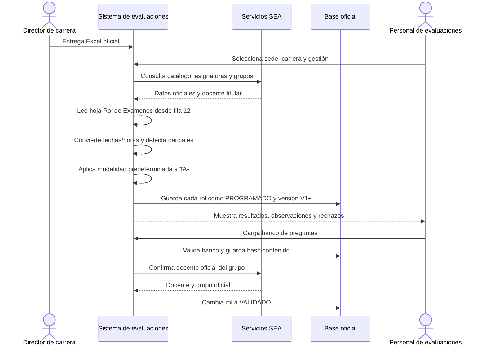
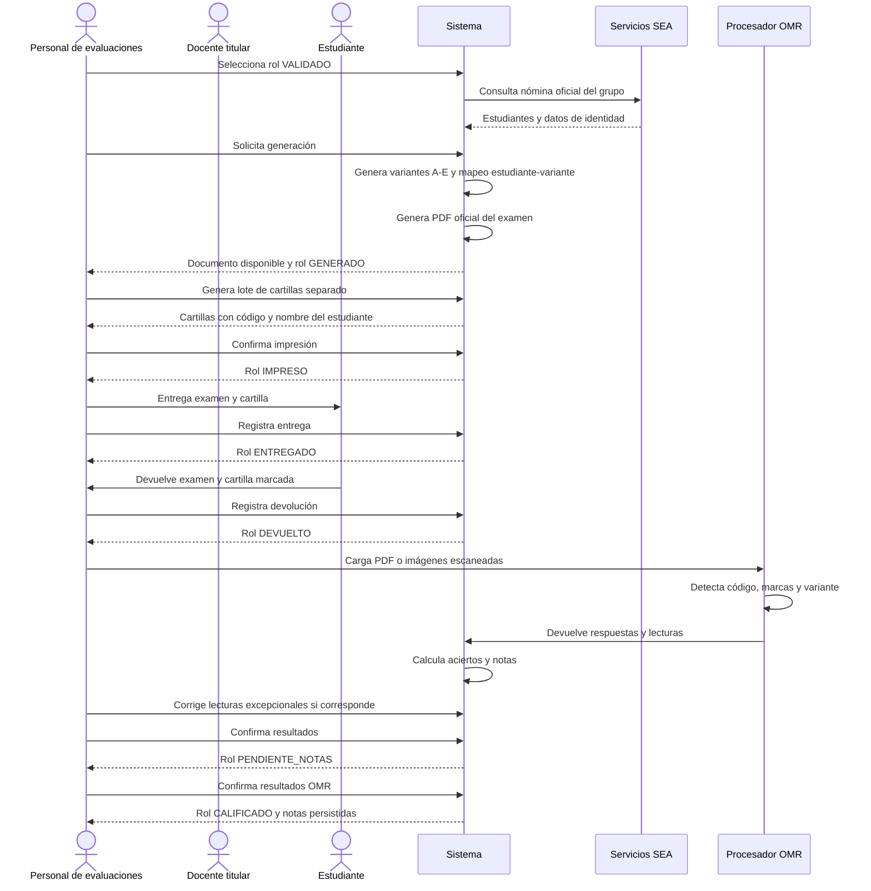
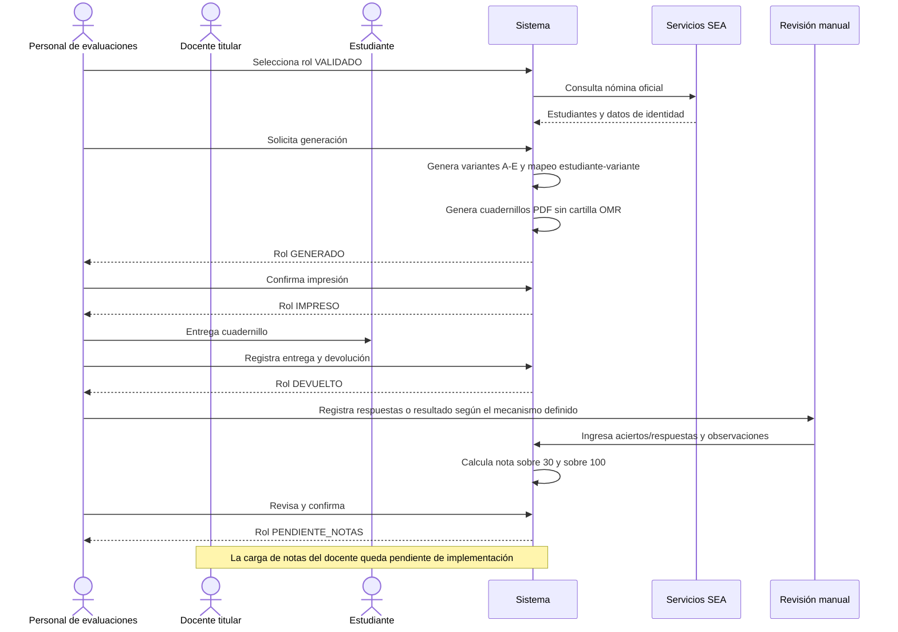
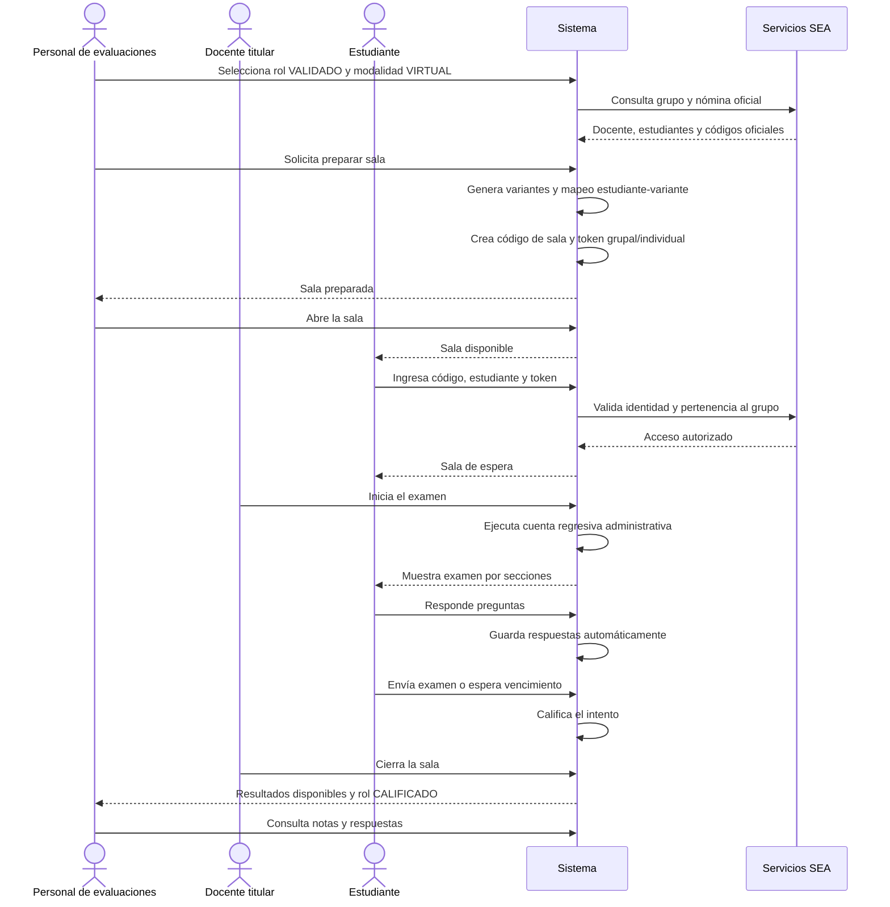

# Flujo de secuencia de uso de evaluaciones

## 1. Objetivo

Este documento define el recorrido operativo desde el registro del rol de examen hasta la obtención y consulta de las notas para las tres modalidades oficiales:

- **Presencial con cartilla**.
- **Presencial sin cartilla**.
- **Virtual**.

El flujo utiliza una única fuente académica oficial: los servicios institucionales **SEA**. El Excel del rol se utiliza únicamente para importar la programación de exámenes y relacionar la asignatura, el grupo, el parcial y la fecha.

## 2. Actores y responsabilidades

| Actor | Responsabilidad principal |
| --- | --- |
| Director de carrera | Elaborar y entregar la programación académica oficial. |
| Personal de evaluaciones | Importar roles, cargar bancos, generar exámenes, controlar estados y consultar resultados. |
| Docente titular | Entregar o validar el banco de preguntas y, en modalidad virtual, iniciar la sala. |
| Evaluador OMR | Procesar escaneos, revisar lecturas y confirmar calificaciones con cartilla. |
| Estudiante | Resolver el examen presencial o ingresar a la sala virtual. |
| Servicios SEA | Proveer sedes, carreras, asignaturas, grupos, docentes, horarios, estudiantes y datos oficiales de identidad. |

## 3. Principios de información oficial

1. El docente titular siempre se consulta en SEA mediante la asignatura y el grupo oficial.
2. No se usa como fuente el nombre del docente escrito en Excel, el docente guardado en el rol local ni un docente genérico de sesión.
3. La nómina y el nombre del estudiante se recuperan de SEA y se vuelven a validar durante la generación o el ingreso virtual.
4. Si SEA no devuelve un docente o un grupo válido, el sistema detiene la operación y muestra el motivo.
5. Si el grupo teórico `TA-##` no trae modalidad en el rol, se asigna **Con Cartilla**.
6. Los roles inician en versión `V1`; una nueva importación del mismo grupo, parcial y fecha genera `V2`, `V3`, etc., sin sobrescribir la versión anterior.

## 4. Flujo común de registro y preparación



### 4.1. Requisitos para validar el rol

- Asignatura y grupo existentes en SEA.
- Docente titular devuelto por SEA.
- Banco de preguntas registrado para el rol.
- Mínimo de **60 reactivos** en el banco: 15 fáciles, 30 medios y 15 difíciles.
- Las cuotas son mínimas: pueden existir reactivos adicionales.
- Hash de integridad y contenido del banco guardados en la base oficial.

El banco tiene como mínimo 60 reactivos, pero cada examen generado utiliza la configuración vigente de preguntas del examen, actualmente **30 preguntas** distribuidas en variantes de `A` a `E`.

### 4.2. Estados comunes del rol

| Estado | Significado | Acción principal |
| --- | --- | --- |
| `PROGRAMADO` | Rol importado y listo para trabajar. | Cargar o reemplazar banco. |
| `VALIDADO` | Banco revisado y aprobado. | Generar examen o preparar sala virtual. |
| `GENERADO` | Variantes, mapeos y documentos generados. | Continuar con impresión o control virtual. |
| `IMPRESO` | Documentos físicos confirmados como impresos. | Entregar a estudiantes. |
| `ENTREGADO` | Exámenes entregados o sala presencial ejecutada. | Recibir/devolver material. |
| `DEVUELTO` | Material físico devuelto para revisión. | Habilitar la carga o lectura de notas. |
| `PENDIENTE_NOTAS` | Se esperan las notas del docente o el procesamiento OMR. | Registrar resultados y calificar. |
| `CALIFICADO` | Resultados confirmados y notas persistidas. | Consultar bitácora y resultados. |

La modalidad virtual utiliza el mismo rol, pero no recorre los estados físicos `IMPRESO`, `ENTREGADO` y `DEVUELTO`.

## 5. Modalidad presencial con cartilla

### 5.1. Secuencia operativa



### 5.2. Obtención de la nota

La cartilla no contiene la clave ni la variante visible. El sistema identifica al estudiante por su código, busca su variante en el mapeo oficial y compara las respuestas leídas con la clave interna.

Se registran por estudiante:

- Aciertos.
- Fallos.
- Blancos.
- Dobles marcas.
- Variante confirmada.
- Nota sobre 30.
- Nota sobre 100.
- Estado: `APROBADO`, `REPROBADO` o `REVISION_MANUAL`.

Fórmulas actuales para un examen de 30 preguntas:

```text
nota_sobre_30  = aciertos × 30 / 30
nota_sobre_100 = aciertos × 100 / 30
```

Una página sin código válido, con una grilla ilegible o con una marca que requiere revisión no se asigna automáticamente por posición. Se mantiene en revisión manual.

## 6. Modalidad presencial sin cartilla

### 6.1. Secuencia operativa



### 6.2. Regla de calificación

La modalidad sin cartilla no utiliza la lectura OMR ni genera una cartilla separada. El PDF sí conserva el orden, la variante y el formato institucional del examen.

Para cerrar este flujo con notas, la captura debe registrar al menos:

- Rol y estudiante oficial de SEA.
- Variante asignada.
- Respuesta por pregunta o cantidad de aciertos.
- Observaciones del evaluador.
- Usuario y fecha de revisión.

La nota debe usar las mismas fórmulas del examen con cartilla. Mientras no exista la captura manual habilitada para esta modalidad, el rol permanece en `PENDIENTE_NOTAS` sin inventar una nota; queda pendiente la pantalla de carga/revisión manual y su endpoint de persistencia.

## 7. Modalidad virtual

### 7.1. Secuencia operativa



### 7.2. Ingreso, continuidad y restablecimiento

- El código de sala identifica la evaluación virtual.
- El token grupal permite el acceso general cuando se comparte con todo el curso.
- El token individual identifica al estudiante cuando se requiere acceso individual.
- Las respuestas se guardan automáticamente en el servidor.
- Si ocurre una interrupción de internet, el personal autorizado puede restablecer la sala indicando un motivo obligatorio, incluso si estaba en curso o cerrada.
- El restablecimiento conserva la trazabilidad y las respuestas guardadas, reabre los intentos no anulados y permite continuar la evaluación.
- La cuenta regresiva inicial y la duración se administran desde **Administración de Evaluaciones**.

### 7.3. Obtención de la nota

Al enviar el examen o vencer el tiempo, el servidor compara las respuestas con la clave de la variante asignada. La calificación es automática y queda vinculada al intento del estudiante.

Se consulta por estudiante:

- Código y nombre oficial.
- Variante.
- Estado del intento.
- Respuestas marcadas.
- Aciertos.
- Nota sobre 30.
- Nota sobre 100.
- Fecha y hora de envío o cierre.

La fórmula es la misma:

```text
nota_sobre_30  = aciertos × 30 / 30
nota_sobre_100 = aciertos × 100 / 30
```

Al cerrar la sala, el rol virtual pasa a `CALIFICADO`. No utiliza los estados físicos `GENERADO`, `IMPRESO`, `ENTREGADO`, `DEVUELTO` ni `PENDIENTE_NOTAS`.

## 8. Consulta final de resultados

La pantalla **Lista de Evaluaciones** debe mostrar el acceso a resultados según la modalidad:

| Modalidad | Fuente de resultados | Acción de consulta |
| --- | --- | --- |
| Con cartilla | Calificaciones OMR persistidas. | Ver estudiante, código, variante, aciertos, notas y estado. |
| Sin cartilla | Registro de revisión/captura manual. | Ver respuestas, observaciones, usuario revisor y notas. |
| Virtual | Intentos virtuales calificados. | Ver respuestas guardadas, aciertos, notas, estado y fecha de envío. |

En todos los casos, la identificación del estudiante debe validarse contra SEA o contra el mapeo oficial generado desde SEA. No se utiliza el orden del PDF, una lista ficticia ni información de ejemplo para completar nombres.

## 9. Auditoría y excepciones

Cada acción relevante debe registrar en la bitácora:

- Rol y modalidad.
- Estado anterior y nuevo estado.
- Fecha y hora del servidor.
- Usuario responsable.
- Motivo, cuando sea restablecimiento, corrección o rechazo.
- Identificador de sala, lote, archivo o procesamiento cuando corresponda.

Excepciones que deben detener o dejar en revisión:

| Excepción | Comportamiento |
| --- | --- |
| Docente no encontrado en SEA | No crear, validar ni generar el examen. |
| Grupo no encontrado o inconsistente | Rechazar el rol y mostrar observación. |
| Banco menor a 60 o con cuotas mínimas incompletas | No validar el banco. |
| Código OMR no reconocido | Mantener página en `REVISION_MANUAL`. |
| Sala virtual sin estudiantes oficiales | No permitir iniciar. |
| Corte de internet | Mantener respuestas guardadas y permitir restablecimiento autorizado. |
| Intento virtual ya calificado | No sobrescribir sin una acción de restablecimiento auditada. |
| Rol en `GENERADO` o posterior | Protegerlo contra reemplazo o eliminación del rol. |

## 10. Casos de uso y endpoints principales

| Caso de uso | Ruta principal |
| --- | --- |
| Listar roles | `GET /api/roles-examen` |
| Registrar o actualizar rol | `POST /api/roles-examen`, `PUT /api/roles-examen/{id}` |
| Cambiar estado | `POST /api/roles-examen/{id}/transicion` |
| Consultar bitácora | `GET /api/roles-examen/{id}/auditoria` |
| Cargar banco | `POST /api/bancos-preguntas/{rolId}/upload` |
| Generar examen físico | `POST /api/generacion-typst` |
| Consultar documento generado | `GET /api/generacion-typst/roles/{rolId}/documento` |
| Generar cartillas | `POST /api/roles-examen/{rolId}/cartillas/generar` |
| Procesar OMR | `POST /api/omr/{rolId}/procesar` |
| Consultar calificaciones OMR | `GET /api/omr/{rolId}/calificaciones` |
| Crear sala virtual | `POST /api/examenes-virtuales/salas` |
| Abrir/iniciar/cerrar sala | `POST /api/examenes-virtuales/salas/{id}/abrir`, `/iniciar`, `/cerrar` |
| Restablecer sala | `POST /api/examenes-virtuales/salas/{id}/restablecer` |
| Validar acceso virtual | `POST /api/acceso-virtual/validar` |
| Guardar respuesta virtual | `PUT /api/examen-virtual/respuestas` |
| Enviar examen virtual | `POST /api/examen-virtual/enviar` |
| Consultar resultados virtuales | `GET /api/examenes-virtuales/roles/{rolId}/resultados` |

## 11. Checklist de recorrido completo

### Preparación

- [ ] Sede, carrera, asignatura, grupo y docente confirmados en SEA.
- [ ] Rol creado con versión y modalidad correctas.
- [ ] Banco validado con mínimos 15/30/15 y al menos 60 reactivos.
- [ ] Rol en `VALIDADO`.

### Con cartilla

- [ ] Variantes y mapeo estudiante-variante generados.
- [ ] PDF generado.
- [ ] Cartillas separadas generadas e impresas.
- [ ] Examen entregado y devuelto.
- [ ] Escaneo procesado.
- [ ] Códigos y lecturas revisados.
- [ ] Notas OMR confirmadas y consultables.

### Sin cartilla

- [ ] Cuadernillos PDF generados sin cartilla.
- [ ] Entrega y devolución registradas.
- [ ] Respuestas o resultados capturados por revisión manual.
- [ ] Nota confirmada y auditada.

### Virtual

- [ ] Sala creada con nómina SEA y variantes.
- [ ] Código y token compartidos.
- [ ] Estudiantes ingresados y validados.
- [ ] Docente inició el examen.
- [ ] Cuenta regresiva y duración aplicadas.
- [ ] Respuestas guardadas.
- [ ] Sala cerrada o tiempo vencido.
- [ ] Notas automáticas consultables por estudiante.
