# Flujo de los tipos de examen

Este documento explica el funcionamiento del sistema para personas que no necesitan conocer los detalles técnicos. Las tres modalidades reutilizan el mismo banco de preguntas, la misma secuencia de preguntas y el mismo cálculo de variantes. Lo que cambia es la forma de entregar, resolver y revisar el examen.

Para el recorrido paso a paso, responsables, notas, endpoints y checklist operativo, consultar [Flujo de secuencia de uso de evaluaciones](flujo-secuencia-uso-examenes.md).

## Cómo leer el diagrama

- **Estado del examen**: etapa oficial que se muestra en **Lista de Evaluaciones**.
- **Estado operativo**: actividad que ocurre dentro de una etapa, por ejemplo imprimir un PDF o abrir una sala.
- **⚙ Configuración requerida**: la transición necesita que exista una configuración o validación previa.
- **Acción operativa**: la transición se completa registrando una actividad realizada por el personal, el docente o el sistema.

## Vista general

```mermaid
flowchart TB
    INICIO([Examen programado])
    CONFIG["⚙ Configuración común<br/>Sede · carrera · grupo · docente · horario · banco de preguntas"]
    INICIO --> CONFIG

    CONFIG --> CARTILLA
    CONFIG --> SIN_CARTILLA
    CONFIG --> VIRTUAL

    subgraph CARTILLA[Presencial con cartilla]
        direction LR
        C1[Programado] -->|⚙ Validar banco y examen| C2[Validado]
        C2 -->|⚙ Ratio + variantes + diagramación| C3[Generado]
        C3 -->|Imprimir PDF y cartilla| C4[Impreso]
        C4 -->|Registrar entrega| C5[Entregado]
        C5 -->|Registrar devolución| C6[Devuelto]
        C6 -->|Automático: entregar a Evaluaciones| C7[Pendiente de calificación]
        C7 -->|⚙ Escaneado + parámetros OMR| C8[Calificado]
    end

    subgraph SIN_CARTILLA[Presencial sin cartilla]
        direction LR
        S1[Programado] -->|⚙ Validar banco y examen| S2[Validado]
        S2 -->|⚙ Ratio + variantes + diagramación| S3[Generado]
        S3 -->|Imprimir cuadernillos| S4[Impreso]
        S4 -->|Registrar entrega| S5[Entregado]
        S5 -->|Registrar devolución| S6[Devuelto]
        S6 -->|Habilitar carga docente| S7[Pendiente de notas]
        S7 -->|Carga manual pendiente| S8[Calificado]
    end

    subgraph VIRTUAL[Examen virtual]
        direction LR
        V1[Programado] -->|⚙ Validar banco y examen| V2[Validado]
        V2 -->|⚙ Ratio + nómina oficial + duración| V3[Preparar variantes y sala]
        V3 -->|Crear código y tokens individuales| V4[Sala preparada]
        V4 -->|Abrir sala| V5[Sala abierta]
        V5 -->|Docente inicia| V6[En curso]
        V6 -->|Vence el tiempo o se cierra| V7[Intentos calificados]
        V7 -->|Automático| V8[Calificado]
    end

    classDef config fill:#fff4d6,stroke:#d97706,stroke-width:2px,color:#78350f;
    classDef estado fill:#f3e8ff,stroke:#7e22ce,stroke-width:1.5px,color:#3b0764;
    classDef operativo fill:#ecfdf5,stroke:#059669,stroke-width:1.5px,color:#064e3b;
    class CONFIG,C2,C3,C6,S2,S3,V2,V3 config;
    class C1,C2,C3,C4,C5,C6,C7,C8,S1,S2,S3,S4,S5,S6,S7,S8,V1,V2,V8 estado;
    class V3,V4,V5,V6,V7 operativo;
```



## Qué se configura antes de cada transición

| Modalidad | Transición | Qué debe estar listo o configurado |
| --- | --- | --- |
| Todas | `Programado → Validado` | Rol de examen oficial, grupo, asignatura, docente, horario y banco de preguntas cargado/validado. La validación encripta el examen del docente. |
| Con cartilla | `Validado → Generado` | Ratio de estudiantes por variante, nómina oficial de SEA y parámetros de diagramación. Se generan variantes, PDF y mapeo estudiante-variante. |
| Sin cartilla | `Validado → Generado` | Ratio de estudiantes por variante, nómina oficial de SEA y parámetros de diagramación. Se generan variantes y cuadernillos PDF, sin cartilla OMR. |
| Con cartilla | `Devuelto → Pendiente de calificación → Calificado` | Al registrar la devolución, el sistema avanza automáticamente al estado operativo que habilita el procesamiento OMR; la confirmación de lecturas pasa a calificado. Internamente se conserva como `PENDIENTE_NOTAS` para compatibilidad del flujo. |
| Sin cartilla | `Devuelto → Pendiente de notas → Calificado` | El estado intermedio queda preparado para la futura carga manual de notas del docente. |
| Virtual | `Validado → Preparar variantes y sala` | Ratio institucional, nómina oficial de SEA, banco validado y duración del examen. No se genera PDF. |
| Virtual | `Sala preparada → Sala abierta` | El personal autorizado publica la sala y comparte el código de sala y cada token individual. |
| Virtual | `Sala abierta → En curso` | El docente verifica el ingreso de los estudiantes y pulsa **Iniciar examen**. El servidor fija el tiempo oficial. |
| Virtual | `En curso → Calificado` | No requiere una transición manual del rol: al vencer la duración o cerrar la sala, el sistema guarda/califica los intentos y pasa el examen a **Calificado**. |

En los bloques de **emparejamiento ampliado**, cada variante conserva completa la
tarjeta de opciones y todos sus subítems, pero presenta los subítems en un orden
barajado determinístico. En los bloques de caso clínico o problema, los subítems
mantienen el orden definido en el banco.

## Configuración administrativa que afecta el flujo

Se administra en **Administración de Evaluaciones**:

1. **Configuración de Exámenes**
   - Ratio: cantidad máxima de estudiantes por variante.
   - Parámetros de diagramación para los PDF presenciales.
2. **Configuración de Tiempos**
   - Duración del examen virtual: valor predeterminado actual de **45 minutos**.
   - Ventanas de generación, publicación de listas y candados de seguridad.

El número de variantes se calcula así:

```text
variantes = techo(nómina oficial / ratio)
```

El sistema utiliza como máximo cinco variantes: **A, B, C, D y E**. Por ejemplo, con 12 estudiantes y un ratio de 5 se preparan 3 variantes.

## Diferencia principal entre las modalidades

| Aspecto | Con cartilla | Sin cartilla | Virtual |
| --- | --- | --- | --- |
| PDF | Sí | Sí | No |
| Cartilla OMR | Sí | No | No |
| Sala y tokens | No | No | Sí |
| Inicio controlado por docente | No aplica | No aplica | Sí |
| Tiempo controlado por servidor | No | No | Sí |
| Estado final | Calificado | Pendiente de notas* | Calificado |

> En el examen virtual, el estado **Calificado** se alcanza después de cerrar la sala y calificar los intentos. La acción de preparar la sala se inicia desde **Validado**, aunque la preparación no cambie todavía el estado oficial del rol. *Sin cartilla permanecerá en **Pendiente de notas** hasta implementar la carga docente.*
