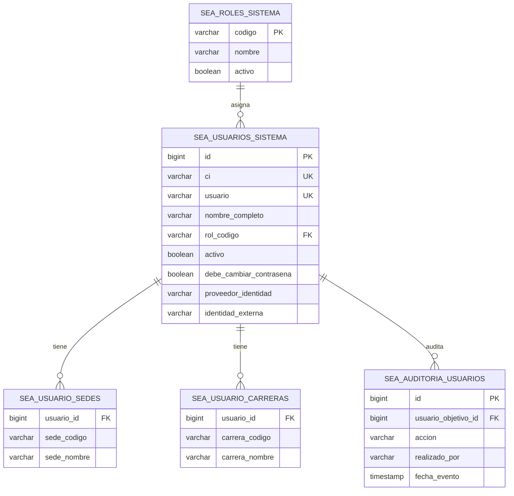

# Módulo de usuarios, roles y alcance académico

## Objetivo

Administrar las cuentas internas del sistema de evaluaciones mientras se prepara la integración con el SSO institucional basado en Keycloak. La cuenta local usa el CI como identificador temporal y obliga al cambio de contraseña en el primer ingreso.

## Actores y alcance

| Rol | Alcance funcional inicial |
|---|---|
| `ADMINISTRADOR_SISTEMA` | Administra usuarios, roles, sedes, carreras y configuración general. Puede asignar cualquier rol. |
| `RESPONSABLE_EVALUACIONES` | Administra usuarios operativos y la gestión del proceso de evaluaciones. No puede asignar `ADMINISTRADOR_SISTEMA`. |
| `PERSONAL_EVALUACIONES` | Opera generación, impresión, entrega, recepción y calificación OMR según sus asignaciones. |
| `DIRECTOR_CARRERA` | Consulta y gestiona el rol de exámenes de las carreras asignadas. |
| `DOCENTE` | Accede únicamente a sus bancos de preguntas y salas virtuales asignadas; no accede al Plan de Estudios ni a la Lista de Evaluaciones. |
| `VICERRECTOR` | Consulta reportes de las sedes asignadas. |

El alcance académico se registra mediante cero o varias sedes y cero o varias carreras. Los códigos y nombres se conservan tal como los entrega el servicio SEA; el sistema no sustituye el formato del nombre completo recibido.

## Acceso operativo del docente

El docente ingresa temporalmente con su CI como usuario. Al completar el cambio obligatorio de contraseña, el sistema consulta su CI y lo compara con el docente oficial que entrega SEA para cada grupo. Por eso, en el plan de estudios y en el catálogo de grupos solo se muestran las materias/grupos cuyo docente oficial coincide con ese CI.

Además, el backend protege el acceso al rol de examen y al banco de preguntas: aunque un docente intente abrir una URL de otro grupo, la operación es rechazada. Las asignaciones de sede y carrera registradas en la cuenta quedan disponibles para los roles directivos y administrativos; la pertenencia docente a grupos se determina por la relación oficial CI-docente del servicio SEA.

## Reglas de negocio

1. El CI es obligatorio, único y se utiliza como usuario de la cuenta interna.
2. En una cuenta nueva, la contraseña temporal es igual al CI y `debe_cambiar_contrasena` queda activo.
3. El primer ingreso dirige al usuario a cambiar la contraseña. La nueva contraseña debe tener al menos ocho caracteres, no puede ser igual al CI y se guarda únicamente como hash BCrypt.
4. Restablecer una contraseña vuelve a establecer el CI como clave temporal y activa nuevamente el cambio obligatorio.
5. Una importación actualiza los datos y asignaciones de una cuenta existente por CI; no reemplaza la contraseña que ya fue cambiada por el usuario.
6. Las cuentas nuevas creadas por lote muestran sus credenciales temporales solamente en el resultado inmediato de la importación.
7. Una persona puede trabajar en varias sedes y carreras. En el Excel se marca una `X` en cada columna correspondiente.
8. Los errores de importación se informan por fila sin detener las filas válidas.
9. Un responsable no puede crear ni asignar el rol de administrador del sistema.
10. Cada alta, modificación, importación y restablecimiento de contraseña genera un registro de auditoría.

## Formato de importación masiva

La hoja `USUARIOS` debe contener como mínimo:

| Columna | Obligatoria | Ejemplo |
|---|---:|---|
| `CI` | Sí | `1112195` |
| `NOMBRE_COMPLETO` | Sí | `MARIEL ROCIO NAVIA ARAMAYO` |
| `ROL` | Sí | `DOCENTE` |
| `SEDE [CBA]` | No | `X` |
| `SEDE [LPZ]` | No | vacío |
| `CARRERA [SIS]` | No | `X` |

Las columnas de sede y carrera se generan como columnas de selección. Se admite `X`, `SI`, `1`, `TRUE` o una marca de verificación. Se pueden seleccionar varias sedes y carreras en la misma fila. Los códigos entre corchetes deben ser los códigos oficiales que entrega SEA.

También se admiten, para integraciones o archivos ya existentes, las columnas `SEDES` y `CARRERAS` con códigos separados por coma, punto y coma o barra vertical.

## Modelo de datos



## Endpoints internos

Todos requieren sesión y los endpoints de administración requieren `ADMINISTRADOR_SISTEMA` o `RESPONSABLE_EVALUACIONES`.

| Método | Ruta | Uso |
|---|---|---|
| `GET` | `/api/usuarios` | Lista cuentas, roles y alcances registrados. |
| `GET` | `/api/usuarios/roles` | Lista roles activos disponibles. |
| `POST` | `/api/usuarios` | Registra una cuenta interna. |
| `PUT` | `/api/usuarios/{id}` | Actualiza nombre, rol, estado y alcances. |
| `POST` | `/api/usuarios/importar` | Importa o actualiza usuarios desde Excel. |
| `GET` | `/api/usuarios/plantilla` | Descarga una plantilla de referencia. |
| `POST` | `/api/usuarios/{id}/restablecer-contrasena` | Genera nuevamente la clave temporal. |
| `POST` | `/api/auth/cambiar-contrasena` | Completa el cambio obligatorio de contraseña. |

## Integración futura con Keycloak

La cuenta conserva `proveedor_identidad = INTERNO` para esta etapa y deja disponibles `proveedor_identidad` e `identidad_externa` para la migración. Cuando Keycloak esté disponible, se debe:

- validar la identidad mediante OIDC/OAuth2;
- mapear los grupos o roles de Keycloak a los códigos internos;
- usar el CI como identificador institucional estable, sin duplicar cuentas;
- mantener sedes y carreras como atributos o relaciones del sistema de evaluaciones;
- desactivar la contraseña local y conservar la auditoría histórica.

## Análisis y sincronización de docentes SEA

El apartado **Usuarios y accesos → Fuente oficial SEA → Sincronización de docentes** compara la nómina docente que SEA devuelve para una gestión con las cuentas internas registradas en el sistema. La comparación se realiza por CI y la información oficial del nombre y los grupos proviene de SEA; los datos locales únicamente indican si existe una cuenta y cuál es su estado de acceso.

### Indicadores y estados

| Indicador/estado | Regla |
|---|---|
| `Docentes en SEA` | Docentes únicos con CI presentes en los grupos de la gestión consultada. |
| `Con acceso` | Docente de SEA con una cuenta activa cuyo rol es `DOCENTE`. |
| `Nuevo` | Docente presente en SEA que todavía no tiene cuenta interna. |
| `Sin acceso` | Docente de SEA con cuenta inactiva. Las cuentas con otro rol se identifican como `Rol diferente` y no se modifican automáticamente. |
| `Ya no está` | Cuenta local con rol `DOCENTE` que no aparece en la nómina SEA de la gestión consultada. |

La ausencia no elimina información histórica: la sincronización masiva la convierte en inactiva y registra el evento en auditoría. Si un docente vuelve a aparecer en SEA, la sincronización reactiva su cuenta. Las contraseñas existentes se conservan; las cuentas nuevas se crean con el CI como clave temporal y exigen cambio en el primer ingreso. Las credenciales temporales se muestran una sola vez en el resultado de la operación.

### Operaciones disponibles

- **Analizar SEA**: consulta nuevamente la gestión indicada, actualiza los cinco indicadores y muestra el detalle por docente.
- **Sincronización individual**: crea, actualiza o reactiva solamente el docente seleccionado.
- **Sincronizar selección**: procesa los docentes marcados que sean nuevos o no tengan acceso.
- **Sincronizar todo**: procesa todos los docentes de SEA y desactiva lógicamente las cuentas `DOCENTE` ausentes de esa gestión, previa confirmación.

### Endpoints internos

| Método | Ruta | Uso |
|---|---|---|
| `GET` | `/api/usuarios/docentes-sea?gestion=2-2026` | Obtiene el análisis, indicadores y detalle de docentes. |
| `POST` | `/api/usuarios/docentes-sea/sincronizar?gestion=2-2026` | Sincroniza docentes nuevos, inactivos o seleccionados. |

El cuerpo de una sincronización puede ser:

```json
{
  "cis": ["1112195", "1110089"],
  "desactivarAusentes": false
}
```

Para la operación masiva se envía `cis: []` y `desactivarAusentes: true`. Ambos endpoints están restringidos a `ADMINISTRADOR_SISTEMA` y `RESPONSABLE_EVALUACIONES`, y cada alta, actualización, reactivación o desactivación deja un registro de auditoría.

## Checklist de cierre

- [x] Registro individual de usuarios.
- [x] Importación masiva con columnas de selección por sede y carrera.
- [x] CI como usuario y contraseña temporal.
- [x] Cambio obligatorio en el primer ingreso.
- [x] Restablecimiento de contraseña.
- [x] Auditoría de operaciones administrativas.
- [x] Rol `DIRECTOR_CARRERA`.
- [x] Campos de transición para Keycloak.
- [x] Filtrado inicial del docente por CI oficial SEA en grupos, materias y banco de preguntas.
- [x] Análisis comparativo de docentes SEA frente a cuentas internas por gestión.
- [x] Sincronización individual y masiva con creación, actualización, reactivación y baja lógica.
- [x] Auditoría específica de operaciones de sincronización SEA y credenciales temporales de nuevas cuentas.
- [ ] Aplicar el mismo control de alcance a cada consulta restante de evaluaciones, OMR, virtuales y reportes.
- [ ] Conectar autenticación y roles con Keycloak cuando el SSO del SEA esté disponible.
